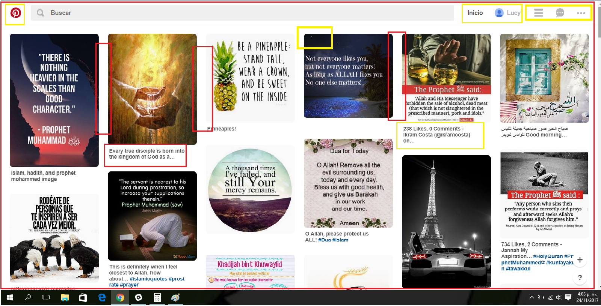

# Reto Nro 1: Explicar que partes conforman un UX y un UI
## Descripción del Proyecto:

Elige una web de tu preferencia(pinterest) y explica qué partes conforman el UX y qué partes el UI.

## Pinterest

## Partes que conforma un UX-designer:

- Diseño de cómo esta maquetado la página.
- Íconos de ayuda al usuario en la barra de navegación
- La página envia notificaciones de temas de interés al usuario.
- Volver al inicio de la página al hacer click en el ícono de Pinterest o en Inicio y refrescarla .
- Poder guardar imagenes en la cuenta para volver a acceder a ellas.
- Al empezar una cuenta nueva te pide que selecciones temas que te agradan para poder llenar el inicio de las imagenes que te agradan sin que tenga que buscar el usuario.
- La página también manda temas relacionados con lo que el usuario esta buscando, asi ayuda al usuario a tener más claro lo que busca.
- El usuario que comparte la imagen tiene la opción de ponerle titulo si asi lo desea a la imagen, con etiquetas.
- La barra de búsqueda siempre esta para el usuario.
- Se puede acceder a Pinterest con tu cuenta de gmail, crear una nueva cuenta o con el facebook, lo que facilita mucho el acceso para el usuario, ya que todos los celulares ,laptop o pc personales usan una cuenta google o gmail y al acceder tienes la opción de usarla sin estar escribiendola o recordando la contraseña.

## Partes que conforma un UI-designer:

- Decidir el espacio que hay entre cada imagen , los bordes de las imagenes para que no se vea tosco .
- Color de las letras en la barra de navegacion y de los titulos de las imagenes(diferente tono de gris).
- Diseño de los botones de acceso.
- Tamaño que ocupa los botones ,el icono de Pinterest , la entrada para la búsqueda de imagens.
- El diseño de cómo se ve la foto de la cuenta, podria ser cuadrada pero es circular.
- Diseño del submenú de cada boton.
- Diseño al iniciar sesión por primera vez.
- Al dar click en una imagen, se crea una ventana emergente que la muestra completa.
- Cuando pasas el mouse en una imagen ésta esta en estado de hover, y se ve un nuevo diseño de un submenú en la imagen, un boton rojo y poder hacer una chincheta en la imagen para guardarla ,etc.
